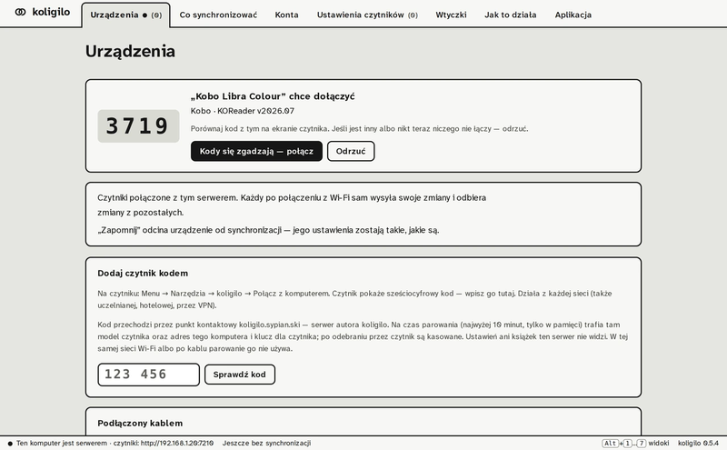

<div align="center">
  
  <h1>koligilo</h1>
  <p>Set up KOReader from a panel on your computer and keep those settings the same on all your e-readers.</p>
  <p>by <a href="https://sypian.ski/">Jakub Sypiański</a></p>
  <p><strong>Beta.</strong> Feedback is very welcome: <a href="https://github.com/sypianski/koligilo/issues">open an issue</a> or write to jakub.sypianski@gmail.com.</p>

  [](LICENSE)
  
  
  

  <p><a href="https://sypian.ski/koligilo/">Website</a></p>

  <p><b>English</b> · <a href="README.pl.md">Polski</a> · <a href="README.eo.md">Esperanto</a></p>
</div>

<p align="center">
  
</p>

Set the font, margins, status bar or style tweaks in a panel on your computer, with the same names, descriptions and presets as in KOReader, instead of going through the menus of each e-reader. Changes made on one e-reader reach the others too, and Wallabag, kosync or Dropbox accounts are entered only once. Everything stays with you: the server is your own computer, not a cloud.

The panel and the reader plugin are in Polish for now.

## Download

The computer side runs on **macOS, Windows and Linux**. It is the same app with the same panel everywhere.

| System | File | Notes |
|---|---|---|
| macOS (Apple Silicon and Intel) | [koligilo.dmg](https://github.com/sypianski/koligilo/releases/latest/download/koligilo.dmg) | Open it and drag koligilo into Applications. Signed and notarised by Apple. It stays in the menu bar after you close the window, so your readers can keep syncing. |
| Windows | [koligilo-windows-amd64.exe](https://github.com/sypianski/koligilo/releases/latest/download/koligilo-windows-amd64.exe) | The panel opens in your browser. On first start, allow access on **private networks** in Windows Firewall, or your readers will not find the computer. SmartScreen: “More info” → “Run anyway”. |
| Linux | [amd64](https://github.com/sypianski/koligilo/releases/latest/download/koligilo-linux-amd64) · [arm64](https://github.com/sypianski/koligilo/releases/latest/download/koligilo-linux-arm64) | `chmod +x` and run it; the panel opens in your browser. If you use a firewall, open TCP 7210 and UDP 47470. |
| E-reader | [koligilo.koplugin.zip](https://github.com/sypianski/koligilo/releases/latest/download/koligilo.koplugin.zip) | Unzip into `koreader/plugins/` and restart KOReader, or connect the reader by cable and let the panel install it. |

On Windows and Linux there is no tray icon yet: the panel works while the process runs, so closing its window stops syncing.

Most testing so far happened on macOS and on Android readers. Reports from Windows, Linux, Kobo, Kindle and PocketBook are especially welcome.

## Set up once, in the panel

The “Ustawienia czytników” (reader settings) tab shows 30 KOReader options in seven sections (font, page layout, document settings, style tweaks, status bar, file browser, reading statistics) with KOReader's own names, descriptions, presets and ranges. A change made there reaches every reader at its next sync. Everything the map does not know is still editable as raw values under “Zaawansowane” (advanced).

Accounts are entered once in the panel: kosync, Wallabag, Dropbox (sign-in with a code), WebDAV and FTP for statistics and vocabulary sync. A new reader gets them with its first sync.

## Choose what goes where

You pick setting groups per device: appearance, font size and margins, style tweaks, fonts, footer and progress bar, dictionaries, gestures, keyboard shortcuts, profiles, file browser, statistics options, accounts, KOPad, on-screen keyboard, AI assistant, Rosetta. Your Kindle can share dictionaries and gestures but keep its own font size.

Settings are merged key by key. Settings that belong to one device (screen DPI, frontlight, paths, Wi-Fi, rotation, night mode) are never synced. If more than half of the synced settings disappear at once, for example because of a damaged file, the reader stops and sends nothing.

## Pairing a reader

On the reader: **Menu → Tools → koligilo → Połącz z komputerem**.

- **Same Wi-Fi:** the reader finds the computer by itself; you compare a 4-digit code and confirm in the panel.
- **Cable:** the panel installs the plugin and pairs the reader.
- **Any other network** (university, hotel, VPN): the reader shows a 6-digit code that you type into the panel.

After pairing, the reader syncs whenever it connects to Wi-Fi, or when you tap “Synchronizuj teraz”. The computer has to be on and reachable (same network or Tailscale); until then changes wait on the reader.

### What passes through the author's server

Only pairing with a 6-digit code from another network uses a rendezvous point at `koligilo.sypian.ski`, a server run by the author. For at most 10 minutes, in memory only, it holds the reader's model, your server's address and the key for that reader; it deletes them as soon as the reader picks them up. It never sees your settings, accounts or books. Pairing over the same Wi-Fi or by cable does not use it. You can run your own: `koligilo --rendezvous URL` on the computer and the `rendezvous` key in `settings/koligilo.lua` on the reader.

## Also

- **Your own server.** Instead of the computer, a VPS can be the server (`koligilo serve`). Data moves between the two without pairing the readers again. Details: [docs/ARCHITEKTURA.md](docs/ARCHITEKTURA.md) (Polish).
- **Plugins.** A gallery of KOReader plugins from GitHub, pinned to a commit. Installing, updating or removing a plugin happens only after you confirm it on the reader (KOReader 2025.08 or newer).
- **What koligilo does not do.** It does not move books or reading progress. Progress and statistics keep syncing through KOReader's own mechanisms; koligilo only distributes their configuration.

## Feedback

koligilo is in beta. If something breaks, behaves oddly or is missing, tell me:

- [Open an issue on GitHub](https://github.com/sypianski/koligilo/issues/new). Bug reports, ideas and questions are all fine there; include your reader model, KOReader version and your computer's system.
- Or email jakub.sypianski@gmail.com.

Before the first sync, back up `settings.reader.lua` and the `settings/` folder from your KOReader directory.

## Building from source

Needs Go 1.24 or newer.

```bash
make test       # Go tests, plugin logic in Lua, UI syntax
make dist       # binaries for macOS, Linux, Windows + plugin zip
make mac-app    # koligilo.app and .dmg (on a Mac)
```

## Support

koligilo is free. If it is useful to you, you can [buy me a coffee on Ko-fi](https://ko-fi.com/sypianski).

## Credits

[KOReader](https://github.com/koreader/koreader) (AGPL-3.0): the option names, descriptions and presets in the panel are generated from its source and translations. The panel uses [Atkinson Hyperlegible Next](https://github.com/googlefonts/atkinson-hyperlegible-next) (SIL OFL 1.1). koligilo is licensed under the GNU Affero General Public License v3.0, see [LICENSE](LICENSE).

---

<p align="center">koligilo · <a href="https://sypian.ski/">Jakub Sypiański</a> · AGPL-3.0</p>
